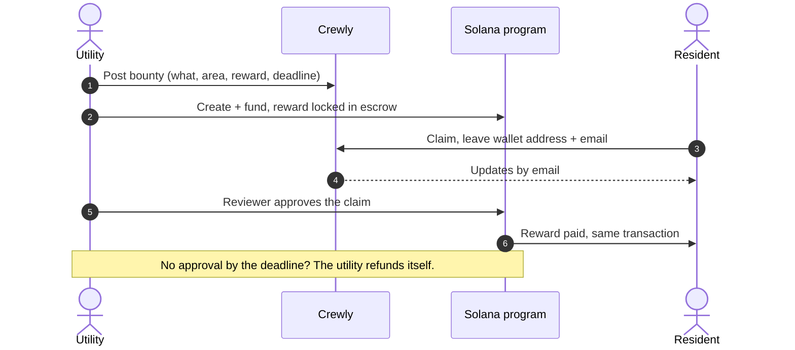
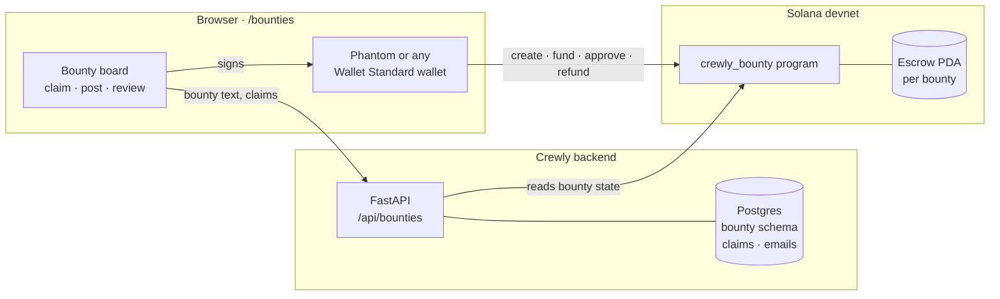

# Crewly Bounties

**Utilities pay people nearby to check storm damage, instead of sending a crew to look.**
Rewards are held and paid out on Solana.

> Runs on **Solana devnet**. Rewards are test SOL. Try it at `/bounties`.

---

## The problem

After a storm, a utility has to find out what is broken before it can fix anything. Is the line down, or just
sagging? Is the tree on the wire or next to it? Is the substation flooded? Today the answer usually means
driving a crew out to look.

That trip is expensive. A two-person storm crew with a bucket truck costs a utility **$400–500 per hour**
([Central Maine Power, via the Portland Press Herald](https://www.pressherald.com/2023/01/29/storm-surge-to-get-lights-back-on-maine-pays-a-premium-for-crews-from-away/)),
and much of that hour is spent driving to a site just to see it.

Someone who lives on that street can take the same photo in two minutes.

## The deal

| | Public | Utility |
|---|---|---|
| **Gives** | A photo or a quick check of something on their street | A small reward per bounty |
| **Gets** | Paid in SOL, straight to their wallet, within seconds of approval | Eyes on the ground without a truck roll, and crews sent only where the work is |
| **Needs** | A Solana wallet address and an email | Nothing new: it posts from a browser wallet |

The reward only has to beat a small part of a crew hour to be worth it for the utility, and for someone
already on that street it is quick money.

## How it works

1. **Post.** The utility describes the job and the broad area (a county or city, never an exact address),
   sets a reward and a deadline, and chooses 1 to 3 reviewers. One wallet transaction creates the bounty and
   locks the reward in escrow.
2. **Claim.** A resident claims it and leaves a Solana address and an email.
3. **Approve.** Once enough reviewers approve (say 2 of 3), the program pays the resident in that same
   transaction.
4. **Expire.** If nobody is approved by the deadline, only the utility can take the reward back.

## Architecture

- **The chain holds the money and the rules.** Who funded the bounty, who may approve it, how many approvals
  it needs, and who got paid.
- **Crewly holds the words and the people.** Bounty descriptions, claims and emails. None of it goes
  on-chain, only SHA-256 fingerprints of it do.
- **Crewly never holds keys or funds.** Every payment is signed in the user's own wallet.

## How we use Solana

Each bounty is its own **program-derived account** (`["bounty", sponsor, id]`) that holds the reward. The
[Anchor](https://www.anchor-lang.com) program behind it has four instructions:

| Instruction | Who signs | What it does |
|---|---|---|
| `create_bounty` | utility | Sets reward, deadline, reviewers (1–3) and how many must approve |
| `fund_bounty` | utility | Moves the reward into escrow, once |
| `approve_submission` | reviewer | Records one approval; the last one needed pays the resident |
| `refund_expired` | utility | After the deadline, returns an unpaid reward |

The program enforces the rules:

- A reviewer can approve only once.
- All approvals must agree on the same claim and the same payout address.
- A bounty can be paid only once.
- Nothing can be approved after the deadline, and nothing can be refunded before it.

We test these cases with [LiteSVM](https://github.com/LiteSVM/litesvm).

**Why Solana fits this job:**

- **Small rewards stay small.** A transaction fee is 0.000005 SOL, so a reward can be cents' worth without
  fees eating it.
- **Paid in seconds.** The resident is paid in the approving transaction, not on an invoice cycle.
- **Anyone can be paid.** A wallet address is enough: no bank details, no vendor onboarding.
- **Trust is in the code.** The resident can see the reward sitting in escrow before doing the work, and the
  utility cannot quietly take it back early.

## Try it

- **Program:** [`4jcrRV3ab8boiXDF6YHdmRu9YwMLzonjuAK9pFSyFZPF`](https://explorer.solana.com/address/4jcrRV3ab8boiXDF6YHdmRu9YwMLzonjuAK9pFSyFZPF?cluster=devnet) on devnet
- **App:** open `/bounties` on Crewly, set your wallet to devnet, and get test SOL at [faucet.solana.com](https://faucet.solana.com)
- **Code:** program in [`programs/crewly_bounty`](programs/crewly_bounty/src/lib.rs), backend in
  [`backend/app/bounties`](../backend/app/bounties), page in [`frontend/src/bounties`](../frontend/src/bounties).
  Build, test and deploy steps are in [README.md](README.md).
